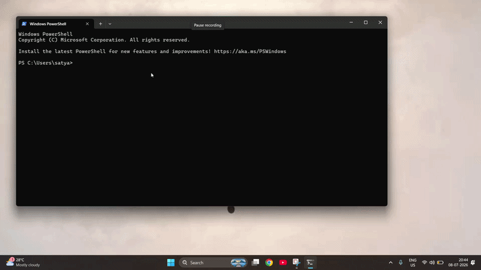

# .dex CLI


.dex is a terminal-first workspace launcher for people who live across web apps, native apps, and browser sessions. Create standalone desktop web apps, group them into named workspaces, capture the state of a working session, and relaunch it from one command.

## .dex in Action
<p align="center">
  
</p>

## Install

The installers are one-shot scripts: they check for Node.js 18+, install or bootstrap Node when possible, fetch or update .dex, install package dependencies, and link the `dex` / `.dex` CLI globally.

### Windows PowerShell

```powershell
irm https://raw.githubusercontent.com/satyam2006-cmd/.dex/master/install.ps1 | iex
```

### macOS and Linux

```bash
curl -fsSL https://raw.githubusercontent.com/satyam2006-cmd/.dex/master/install.sh | bash
```

Restart your terminal after installation if your shell has not refreshed PATH yet.

## Quick Start

```bash
.dex create https://github.com github -w coding
.dex workspace add-os -w coding code
.dex workspace launch -w coding
```

Run `.dex` with no arguments to open the interactive shell. Run `.dex --version` to verify the installed version.

## Commands

See [commands.md](commands.md) for the full command reference covering apps, workspaces, snapshots, profiles, analytics, self-update, and more.

## Updating

```bash
.dex update self
```

Checks the latest version on GitHub and runs the platform installer to upgrade in place.

## Data Location

.dex stores its local database and history in:

```text
~/.dex/
```

The project itself installs to `~/.dex-cli` when using the remote installers.

## Requirements

- Node.js 18 or newer
- npm
- Git, curl, or wget for remote installation
- Windows, macOS, or Linux

## License

Apache-2.0. See [LICENSE](LICENSE).
