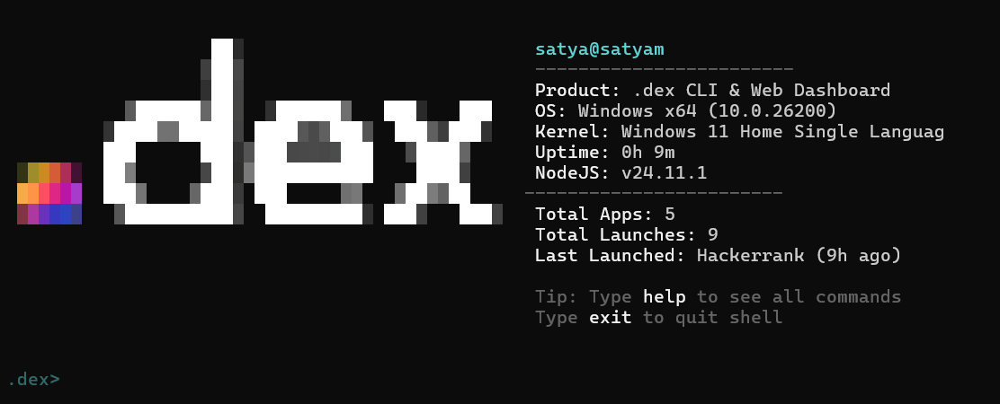

# .dex CLI



.dex is a terminal-first workspace launcher for people who live across web apps, native apps, and browser sessions. Create standalone desktop web apps, group them into named workspaces, capture the state of a working session, and relaunch it from one command.

## Install

The installers are one-shot scripts: they check for Node.js 18+, install or bootstrap Node when possible, fetch or update .dex, install package dependencies, and link the `dex` / `.dex` CLI globally.

### Windows PowerShell

```powershell
irm https://raw.githubusercontent.com/satyam2006-cmd/.dex/master/install.ps1 | iex
```

### macOS and Linux

```bash
curl -fsSL https://raw.githubusercontent.com/satyam2006-cmd/.dex/master/install.sh | bash
```

Restart your terminal after installation if your shell has not refreshed PATH yet.

## Quick Start

```bash
.dex create https://github.com github -w coding
.dex workspace add-os -w coding code
.dex workspace launch -w coding
```

Run `.dex` with no arguments to open the interactive shell. Run `.dex --version` to verify the installed version.

## CLI Commands

### Apps

```bash
.dex create <url> [name] [--icon <path_or_url>] [--hidden] [-w <workspace>]
.dex launch <app...>
.dex launch -os <native-app>
.dex list [--all|--hidden]
.dex search <query>
.dex info <app>
.dex update <app-id> [--url <url>] [--name <name>] [--hidden <true|false>] [--unlock] [--workspace <name,csv>]
.dex remove <app>
```

`create` turns a URL into a registered desktop app. On Windows it also creates desktop and Start Menu shortcuts, with optional custom icons and hidden/camouflaged shortcuts.

### Workspaces

```bash
.dex workspace create -w <name>
.dex workspace list
.dex workspace add -w <name> <app>
.dex workspace add-os -w <name> <native-app>
.dex workspace launch -w <name>
.dex workspace rename -w <old-name> <new-name>
.dex workspace remove -w <name> <app>
.dex workspace delete -w <name>
```

Workspaces can contain .dex web apps, discovered native OS apps, and system commands. Launching a workspace starts the whole set together.

### Snapshots and Browser Capture

```bash
.dex capture install
.dex capture status
.dex capture <snapshot-name>
.dex snapshot save <name>
.dex snapshot restore <name>
.dex workspace import -w <name> chrome
```

The bundled browser extension can capture live tabs from Chromium browsers for accurate session snapshots. The fallback parser still works without the extension, but the extension is the clean path for active-tab capture.

### Analytics and Backup

```bash
.dex recent
.dex stats
.dex summarize
.dex suggest
.dex clean
.dex export <file.json>
.dex import <file.json>
```

## Data Location

.dex stores its local database and history in:

```text
~/.dex/
```

The project itself installs to `~/.dex-cli` when using the remote installers.

## Requirements

- Node.js 18 or newer
- npm
- Git, curl, or wget for remote installation
- Windows, macOS, or Linux

## License

Apache-2.0. See [LICENSE](LICENSE).
